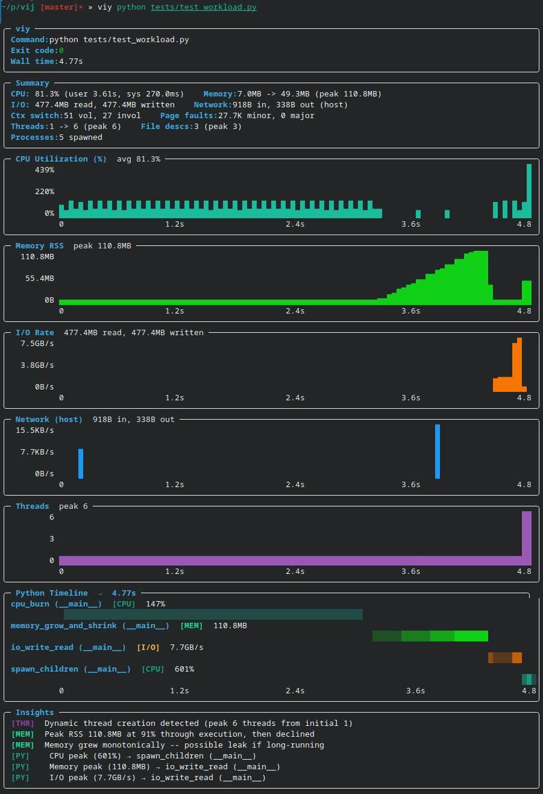

.. post:: 18 Apr, 2026
   :tags: rust, python, debugging, performance, monitoring
   :category: rust
   :author: Maksym Shalenyi
   :excerpt: 1
   :image: 0
   :nocomments:

Viy: Simple End-to-End Process Monitoring for Linux
=====================================================

**Viy** is a simple process monitoring tool for Linux that gives you a full historical view of your process's resource usage — not just the final peak, but a complete timeline across the entire run. Named after Вій, a creature from Ukrainian folklore known for its powerful gaze that sees through everything, this tool helps you see through your program's resource usage over its lifetime.

**GitHub**: https://github.com/enkidulan/viy

The Problem That Started It All
--------------------------------

A few weeks ago, I was debugging a Python data processing script that was consuming much more memory than expected. The script would start fine, but somewhere during execution memory would spike to over 5GB before dropping back down. To fix it, I needed to know *when* and *why* — but how do you pinpoint the memory-hungry part?

The Traditional Approach: Multiple Tools
-----------------------------------------

The standard toolkit covers only a slice of the problem:

- ``time -v``: single peak RSS number at exit, no timeline, no function correlation
- ``top``/``htop``: live snapshot only, no history, easy to miss short-lived spikes
- ``print()`` + ``resource.getrusage()``: requires source modification, only captures what you explicitly instrument, misses everything in between
- ``memory_profiler``: slow, Python-only, requires instrumentation
- ``ptrace`` when things get particularly hard to track down

None of it gives a full picture. The core problem is that you only ever see final, maximum, or aggregated numbers — never the full history. ``time -v`` gives one number at exit. ``top`` shows the current moment but records nothing. Print statements only capture the exact lines you instrumented, so spikes between them are invisible; a smart context manager could help, but you still have to modify the source every time. If the process spawned children — a worker pool, a subprocess, a compiler invocation — things got even messier, since each child has its own PID and none of the above tools aggregate across the tree.

Building Viy: Rust + Python = Strength
-----------------------------------------

As the existing tools lacked what I wanted:

- **A historical timeline** of resource usage across the full run
- **Function-level correlation** with resource spikes
- **All metrics together** (CPU, memory, I/O, threads)
- **Zero code modification** 

The frustration led me to build Viy, and I chose Rust for several reasons:

1. **Performance**: Polling ``/proc`` every 10ms with <0.1% overhead
2. **Easily distributable**: Single static binary, no runtime dependencies
3. **Low-level system access**: Rust gives direct access to the primitives needed

The core idea is very simple: spawn a process, poll ``/proc/[pid]/*`` at high frequency, aggregate metrics including Python function calls, and present them as time-series charts.

Here's the heart of the sampler:

.. code-block:: rust

    pub fn sample(&mut self) -> Result<Sample> {
        let stat = procfs::process::Process::new(self.pid)?.stat()?;
        let io = procfs::process::Process::new(self.pid)?.io()?;
        let status = procfs::process::Process::new(self.pid)?.status()?;
        
        Ok(Sample {
            timestamp: Instant::now(),
            cpu_user: stat.utime,
            cpu_system: stat.stime,
            memory_rss: stat.rss * page_size,
            io_read: io.read_bytes,
            io_write: io.write_bytes,
            threads: stat.num_threads,
            // ... more metrics
        })
    }

Debugging With Viy
-------------------

Now let's see the difference. Viy lets you see all stats on the same timeline:

**Instantly visible:**

- When memory spikes happen
- Peak values and when they occur
- Which functions are the culprits
- When memory is released

Compare that to juggling multiple tools and spending 5–10 minutes hunting down the culprit — with Viy it takes 5 seconds.

What Viy Is Not
---------------------

Viy is a lightweight observability tool, not a full profiler. It's worth being clear about what it doesn't do:

- **Not a tracing tool** — it doesn't record individual function calls, syscalls, or execution traces; it samples at intervals
- **Not a precision profiler** — sampling at 10ms intervals means short-lived events can be missed; for microsecond-level profiling use ``perf`` or ``py-spy`` directly
- **Not a production monitoring solution** — it's designed for local debugging sessions, not long-running production workloads
- **Linux only** — relies on ``/proc`` filesystem, won't work on macOS or Windows
- **Python function correlation is best-effort** — stack sampling can misattribute fast functions or miss calls that complete between samples
- **Limited network metrics** — tracks system-wide only, not per-process

Installation & Usage
--------------------

.. code-block:: bash

    # Install
    curl -L https://github.com/enkidulan/viy/releases/latest/download/viy -o ~/.local/bin/viy
    chmod +x ~/.local/bin/viy
    
    # Use
    viy python script.py
    viy --json ./benchmark
    viy --py-filter "*models.py" python train.py

Afterword
----------

Building Viy was fun and taught me a lot of Rust along the way. The tool is open source and available at https://github.com/enkidulan/viy
